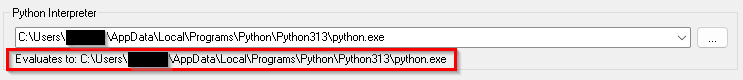
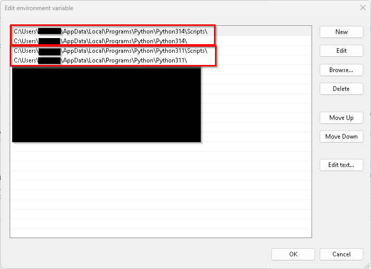
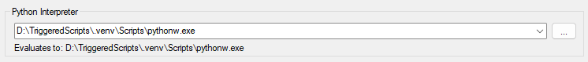
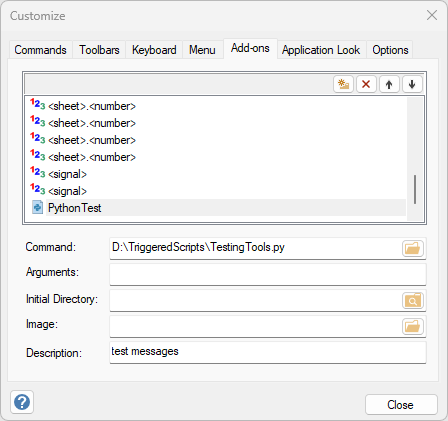
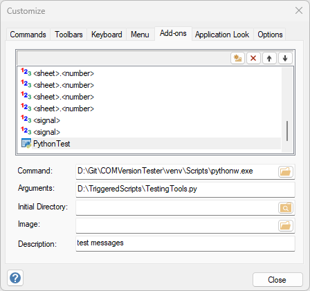
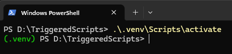
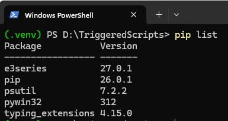

# Python Installation and Virtual Environments

## Python Installation

### Which python is used

It is posssible to have multiple python installations on your system. Which one will be used when running a script can be determined in the following ways (From top to bottom the most important when working with E3.series):
- Take a look in the "General" tab in the settings. The python interpreter used is shown below the Combobox to change it. 
- Open a Powershell (**not** as administrator) and type the following command: `(Get-Command cmd).Path`
- Take a look into the environment variables.
- Check your entries in the tool menu to make sure your script isn't using another interpreter as the default one.

### python.exe vs pythonw.exe

The only difference between using the python.exe over the pythonw.exe ist that a terminal window will be shown when running a script. This might be helpful if you want to use print-commands instead of printing into the E3.series message window.
So normally you want to use pythonw.exe to suppres the terminal window.

### Environment variables

We recommend checking the box to add Python to PATH during the installation. If you forgot you can fix this anytime.
1. Search for "environment" in the windows search in your taskbar.
2. Click the button "Environment Variables..." in the dialog that opens up
3. Now you see two lists of environment variables. The top one is user specific, the bottom one "System variables" has effect on all users using this machine (You are only able to edit those if you are an administrator).
4. Find "Path" in the "User variable for \<username\>" 
5. There should be two entries
    - One for the main folder
    - One for the scripts folder
    In the example shown there are two python installations on the system (3.14 and 3.13). In this case the first one will be used (.3.14 in this example).
6. If those two lines are missing you can enter them using the button "New"
7. There should be the python.exe and pythonw.exe in the main folder

### Python installation using the Windows Store

So far we can only say: "Don't do it". It might mess up your configuration in weird ways we've not fully solved yet.

## Virtual environments

It might happen, that you need the same package installed from pip in different versions in two of your scripts. Or you have a conflict of names used in your scripts. In this case you can use virtual environments.
It also might be an idea to create a virtual environment especially for E3.series to not interfere with other python scripts running on your machine in another context.

A virtual environment is used to create a clearly defined environment to run your poject in. More on this you can find here: [venv - Creation of virtual environments](https://docs.python.org/3/library/venv.html)

You can use them in E3.series in the following ways:
If you use the exe contained in the virtual environment in the settings, the virtual environment will be used for your python files in the tools:

This way you only need to add your python script in the Add-Ons definition:


if you want to use different virtual environments for different scripts you can set the python.exe (or pythonw.exe) as "Command" in the Add-Ons tab. The python script itself (as well as additional attributes if needed) is set in the field "Argument":


### Installing packages in virtual environments

The easiest way to install your needed package is using powershell, activating your virtual environment and install them via pip as usual. To activate the virtual environment open up a powershell and run the activate command within the folder Script of your virtual environment:

Afterwards the name of your virtual environment should be shown in front of the currrent folder. Now you can run pip as usual.

It is also possible to copy the packeges needed from other environments. They can be found in the subfolder "Lib". Just don't forget to copy all dependencies too.

### Checking which python packages are installed

To check which packages are installed in which version you can use `pip list`. Don't forget to activate the virtual environment you want to check first (See the previous section "Installing packages in virtual environments").


### Checking which python environment is used

If you ever have trouble figuring out which python interpreter is used you can use the following script:

```
import e3series 
import sys
python_exec = sys.executable
python_version = sys.version
e3.PutMessage(f"Python:        {python_exec}")
e3.PutMessage(f"Version:       {python_version}")
```
Just save this this script anywhere and add it to E3.series in the Add-Ons tab.

If this fails, probably because e3series is not installed or not running you can also use `print()` insted of `e3.PutMessage()`. Just remember to use python.exe instead of pythonw.exe and probably add a `sleep` or `input` to be able to see the output.
