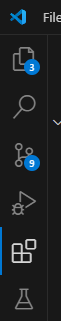
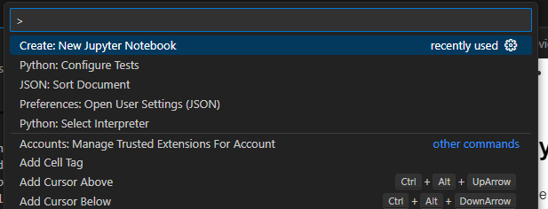
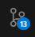
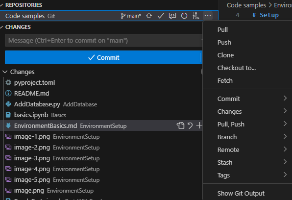
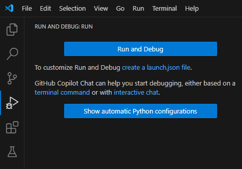
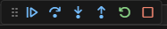
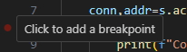

Environment basics for E3.series with python
===========================================

# Setup

## Python

Python can be downloaded from the offical website: https://www.python.org/downloads/
We recommend choosing the latest fully released version.
Consider adding python to the PATH variable during installation. This might prevent later trouble.

## VSCode
We recommend using Visual Studio Code (short: VSCode) as an editor and debugger for working with the E3.series python library.
VSCode is a free open source software by Microsoft and can be downloaded at the offical website: https://code.visualstudio.com/

An alternative to VSCode might be PyCharm by Jetbrains, which is also free in it's basic form.

## VSCode extensions

Clicking on the extensions symbol on the left in VSCode brings you to the extension manager. 
 
Here you can search, install and uninstall extension in VSCode. If you already downloaded this repository and opened the main folder with VSCode (File -> Open Folder...) there should be some recommended extensions.

These extensions are:
- Python: extension for VSCode
- Pylance: python language support and auto competion (Should be coming with the basic python extension)
- Python debugger: Debugging tools for python (Should be coming with the basic python extension)
- Mypy typechecker: Type checker for mython (Should be coming with the basic python extension)
- Jupyter: Jupyter notebook support for VSCode. Enables Markdown-blocks in between code blocks, separate execution of code blocks and visualization of the results.

## Python packages

The only neccesarry python package is e3series. For the code samples in this repository some more packages need to be installed:
| Name | Installation command | Description |
| --- | --- | --- |
| e3series | pip install e3series | E3.series python library |
| pandas |	pip install pandas |	Analysis, manipulation of labeled data |
| tkinter |	pip install tkinter | Easy to use GUI builder |
| openpyxl |	pip install openpyxl |	Writing/reading xlsx/xlsm |

**Installing a package**

To install a python package you can use pip. The command may, depending on your environment, be named pip3. While installing packages it is important to make sure to use the correct instance of pip, if you have multiple instances of python installed. Also tke care if you are using virtual environments to choose the correct one.

Installing the most recent version:

    pip install e3series

Installing from a local .whl or tar.gz file

    pip install --force-reinstall "C:\Users\<user>\Downloads\e3series-26.0.0.tar.gz"

The option "--force-reinstall" ensures the package is reinstalled, even if it already is up to date

Installing a specific version

    pip install --force-reinstall "e3series==0.1.0"

**Version of the e3series package**

The versions of the E3.series python library are meant to be according to the TLB version of E3.series they are meant to be used with. The TLB version is the version of the type library (the COM interface). This version increases each time to the current version of E3.series, if something changed in the type library. This means the version suited best for your version of E3.series is the one with an equal version number or the greatest smaller version.

# Basic usage

## VSCode

**Configure**

Many Settings and commands in VSCode are hidden behind the Text command bar at the top. All commands begin with ">". Simply typing this single character shows a list of available commands in which you can search by further typing.

**Editing**

"File -> Open Folder..." opens a folder on the left to manage your projects.

To create a new Jupyter notebook simply type " > jupyter" at the top and select the command to create a new jupyter notebook. 
On the top right your active python instance/environment is shown. Click it to change it.
New code blocks or markdown blocks can be added using the buttons at the top and bottom of each existing block, which appear by hovering the mouse over the block.

If you have git installed you can use the menu on the left to manage your repositories.
To clone a repository you can clock on the 3 little dots or simply type "> Git: Clone" at the top.

In this sub menu you also find pull, push and others.
Commit and push is hidden behind the arrow on the right of the blue button.
If you missed giving a commit message a file will be displayed. Simply type your message into this without a leading "#" and click the check mark on the top right.

Use F12 to find a variable or method definition.

**Executing**

If not using Jupyter your active python environment is shown on the bottom right of the editor. To change it simply click it and select the interpreter you wish at the top or use "> Python: Select Interpreter" to get to the same selection window.

The Execution of a file can be started by clicking the play button on the top right.

**Debugging**

The debugging menu is the play button with the little bug on the left. while you have no configuration files it will look like this:

Here you can add a configuration file or simply "Run and Debug". Also see https://code.visualstudio.com/docs/python/debugging.

While debugging there is a control bar at the top:

By hovering the buttons they also how their hotkeys. (F5: Run, F10: Step, F11: Step into)

You can set breakpoints by clicking left to the line numbers:

